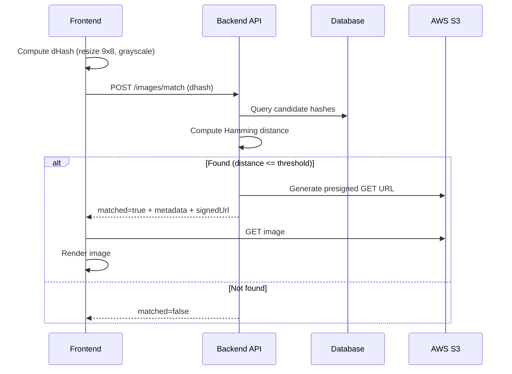
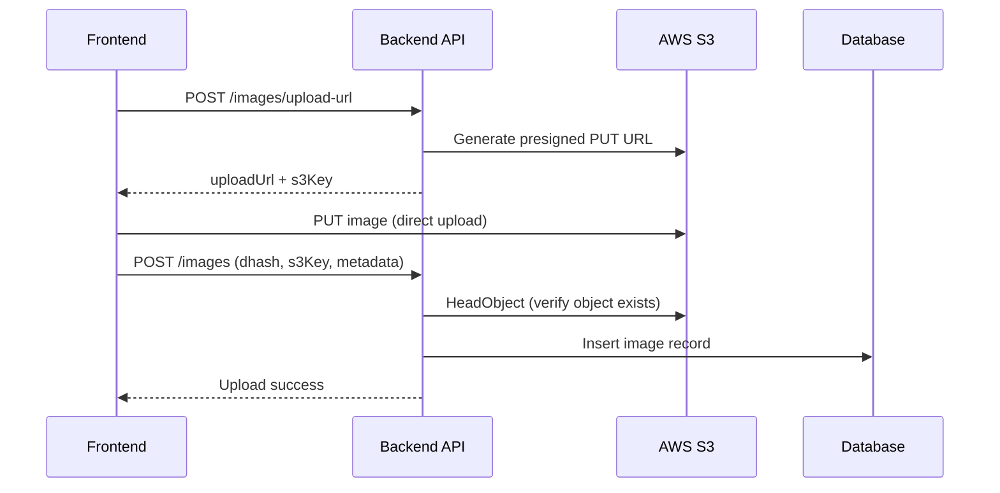

# Image Similarity & Upload Flow (dHash + S3)

## Luồng 1: Match ảnh (KHÔNG upload)

Quy trình kiểm tra xem ảnh đã tồn tại trong hệ thống chưa dựa trên mã băm dHash.



## Luồng 2: Upload ảnh mới

Quy trình tải ảnh lên S3 và lưu thông tin vào Database nếu không tìm thấy ảnh trùng lặp.



## Tổng quan quy trình (Flowchart)

```mermaid
flowchart TD
    A[User selects image] --> B[Compute dHash]
    B --> C[POST /images/match]

    C -->|matched| D[Request signed GET URL]
    D --> E[Render image]

    C -->|not matched| F[POST /images/upload-url]
    F --> G[PUT image to S3]
    G --> H[POST /images (save DB)]
    H --> I[Render uploaded image]
```
