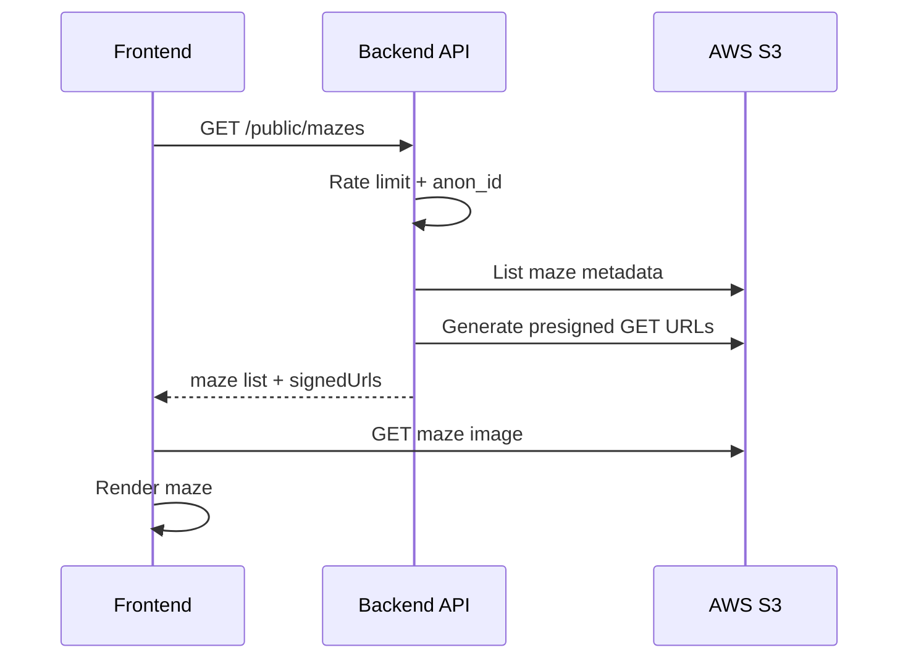
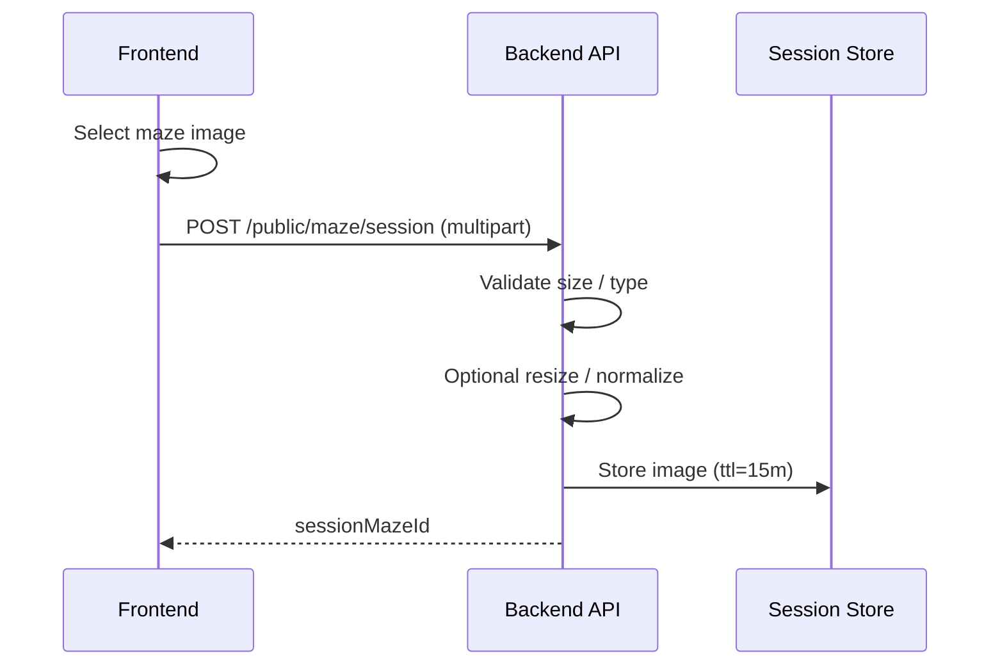
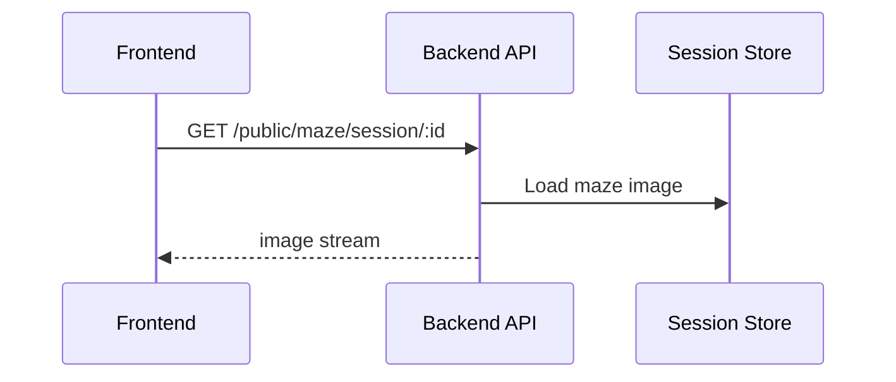
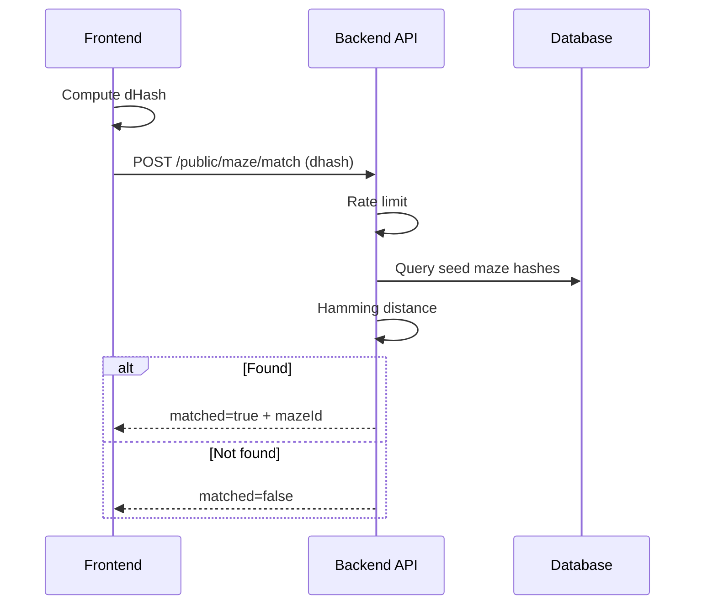
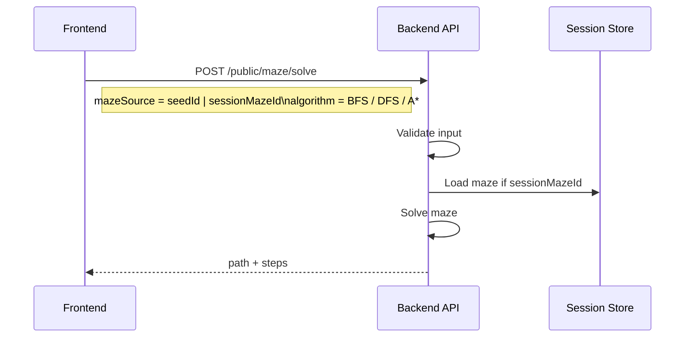
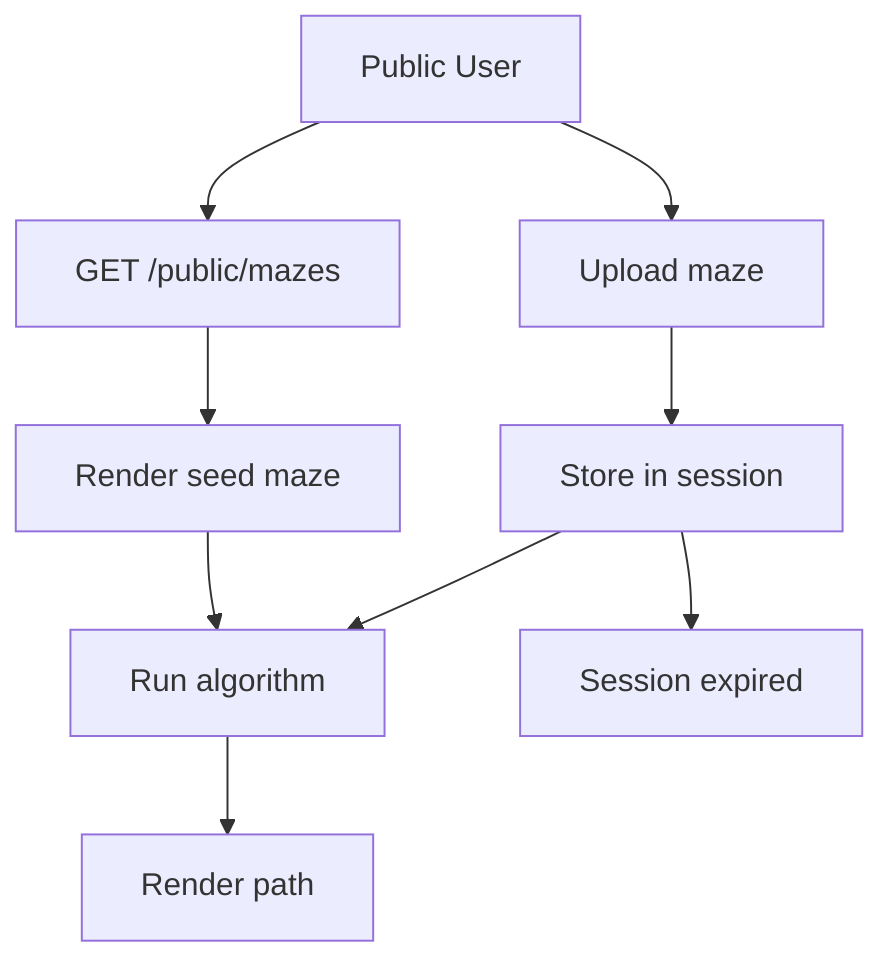

# Public User – Maze API Flow

## Tổng quan vai trò

- **Frontend**
  - Chọn maze có sẵn
  - Upload maze tạm thời
  - Chạy thuật toán giải maze

- **Backend API**
  - Gatekeeper cho public user
  - Rate limit
  - Quản lý session
  - Validate input

- **S3**
  - Chỉ chứa maze seed
  - Read-only
  - Không public trực tiếp

- **Session Store**
  - Lưu maze upload tạm thời của public user
  - Có TTL

---

## 1. Load danh sách maze có sẵn (S3 – Read Only)

## 2. Public user upload maze (Session Only)

### Constraints

- Maze upload của public user **không được lưu vĩnh viễn**
- Không ghi dữ liệu vào database
- Không upload lên S3
- Dữ liệu chỉ tồn tại trong session với TTL giới hạn

## 3. Lấy lại maze trong session (Preview / Rerun)

## 4. Match / Nhận diện maze (dHash – Seed Only)

Public user chỉ được match với maze seed, không match với dữ liệu upload của user khác.

## 5. Chạy thuật toán giải maze (Stateless)

Backend không lưu trạng thái giải bài toán của public user.

## 6. High-level Flowchart (Public User)

## 7. API Scope Tóm Tắt

| Endpoint | Ghi DB | S3 | Session |
| :--- | :--- | :--- | :--- |
| `GET /public/mazes` | No | GET | No |
| `POST /public/maze/session` | No | No | Yes |
| `GET /public/maze/session/:id` | No | No | Yes |
| `POST /public/maze/match` | No | No | No |
| `POST /public/maze/solve` | No | No | Optional |

## Nguyên tắc thiết kế

1. **Quyền hạn**: Public user không có quyền ghi dữ liệu lâu dài.
2. **Bảo mật S3**: Không cấp presigned PUT cho public user.
3. **Lưu trữ tạm thời**: Mọi dữ liệu upload chỉ tồn tại trong session.
4. **Kiểm soát lưu lượng**: Rate limit bắt buộc cho tất cả public endpoints.
